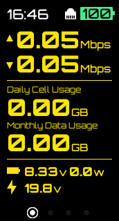

# PhotoniCat2 Mini Display

A Go-based display driver for the Photonicat2 mini display, providing real-time system information, network status, and device metrics on a small LCD screen.

## Sample Screen




## Update Frequencies & Intervals

### Display Rendering
| Component | Update Frequency | Frame Rate | Notes |
|-----------|-----------------|------------|--------|
| **Main Display** | 5 FPS target | 200ms per frame | `desiredFPS = 5` |
| **Top Bar** | Every 10 frames | ~2 seconds | Time, battery, connection status |
| **Footer** | Every 5 frames | ~1 second | Page indicators, SMS status |
| **Middle Content** | Every frame | ~200ms | Main data display area |
| **Page Animation** | 16 intermediate frames | Smooth transitions | During page changes |

### Data Collection Intervals

#### System Data
| Data Source | Collection Interval | Data Includes | Function |
|-------------|-------------------|---------------|----------|
| **Linux System** | 2 seconds | CPU, memory, uptime, disk, temp | `collectLinuxData()` |
| **Battery** | 1 second | SOC, voltage, current, charging status | `collectBatteryData()` |
| **Network Basic** | 2 seconds | Local IP, WAN IP, public IP, SSID | `collectNetworkData()` |
| **Network Speed** | 3 seconds | WAN upload/download speeds | `collectWANNetworkSpeed()` |

#### External APIs
| API Source | Collection Interval | Data Includes | Function |
|------------|-------------------|---------------|----------|
| **PCAT Manager Web** | 10 seconds | ISP, signal strength, connection type, data usage | `getInfoFromPcatWeb()` |
| **SMS Collection** | 60 seconds | SMS messages for display | `getSmsPages()` |

#### Network Connectivity
| Test Type | Collection Interval | Timeout | Special Handling |
|-----------|-------------------|---------|------------------|
| **Ping Site 0** | 2 seconds | 5 seconds | Red "X" for >3s timeout |
| **Ping Site 1** | 2 seconds | 5 seconds | Keep last successful value |
| **Success Rate** | Calculated per ping | - | Tracks ping reliability |

### Screen Management

#### Power & Brightness
| Setting | Default Value | On Battery | On DC Power |
|---------|---------------|------------|-------------|
| **Screen Dimmer Timeout** | 60 seconds | 60 seconds | 86400 seconds (24h) |
| **Idle Fade Duration** | 2 seconds | - | - |
| **Fade In Duration** | 300ms | - | - |
| **Zero Backlight Delay** | 5 seconds | - | - |
| **Power Off Timeout** | 3 seconds | - | - |

#### Display Optimization
| Feature | Frequency | Purpose |
|---------|-----------|---------|
| **Top Bar Cache** | Only when content changes | Avoid unnecessary redraws |
| **Footer Cache** | Only when content changes | Performance optimization |
| **FPS Display Update** | Every 100ms | Debug information |
| **Log Output** | Every 300 frames (~60s) | Reduce log spam |

### HTTP Server Timeouts
| Client Type | Timeout | Purpose |
|-------------|---------|---------|
| **External HTTPS** | 10 seconds | Public API calls |
| **TLS Handshake** | 5 seconds | Secure connections |
| **Local HTTP** | 15 seconds | Internal API calls |

### Performance Metrics
| Metric | Target/Actual | Notes |
|--------|---------------|-------|
| **Target FPS** | 5 FPS | Main rendering loop |
| **Page Change FPS** | Variable | Depends on animation complexity |
| **Frame Sleep** | ~200ms | Maintains stable FPS |
| **Background Sleep** | 50ms | When main loop disabled |

## Configuration Files

### Main Config: `config.json`
- **Ping targets**: `ping_site0`, `ping_site1`
- **Display templates**: Page layouts and elements
- **Screen settings**: Brightness, timeout values
- **SMS settings**: Enable/disable SMS display

### User Config: `/etc/pcat2_mini_display-user_config.json`
- User-specific overrides

### System Config: `/etc/pcat2_mini_display-config.json`
- System-wide defaults

## Display Elements

### Top Bar (32px height)
- **Time**: Real-time clock (HH:MM format)
- **Network**: 4G/5G/WiFi/Ethernet indicators
- **Signal Strength**: 4-bar signal indicator
- **Battery**: SOC percentage with charging indicator

### Middle Section (Variable height)
Multiple pages with rotating content:
- **Page 0**: WAN speeds, data usage, battery details
- **Page 1**: Ping results with success rates, IP addresses, SSIDs
- **Page 2**: CPU, memory, uptime, OS version, serial number
- **Page 3**: ISP info, cell bands, SIM status, client counts, temps
- **SMS Pages**: When SMS display enabled

### Footer (22px height)
- **Page indicators**: Dots showing current page
- **SMS indicator**: Shows SMS page count when active

## Ping System Details

### Ping Logic
- **Timeout detection**: >3 seconds shows red "X"
- **Value persistence**: Keeps last successful ping on failure
- **Success tracking**: Calculates percentage success rate
- **Error codes**:
  - `-2`: Timeout (>3 seconds) → Red "X" display
  - `-1`: Error with no previous success → "-" display
  - `>0`: Successful ping time in milliseconds

### Debug Output
Comprehensive stdout logging shows:
- Raw ping execution details
- Timeout and error detection
- Success rate calculations
- Final display values

## Hardware Integration

### Display Driver: GC9307
- **Resolution**: 172x320 pixels
- **Rotation**: 180 degrees
- **Offset**: 34 pixels X offset
- **Margins**: L:8, R:7, T:10, B:7 pixels

### GPIO Pins
- **RST**: GPIO122
- **DC**: GPIO121  
- **CS**: GPIO13
- **Backlight**: PWM controlled

## Software Architecture

### Key Features
- **HTTP Server Integration**: Control display via HTTP GET/POST requests
- **Real-Time Display Updates**: Efficient frame rendering with dynamic FPS monitoring
- **Hardware Interfacing**: periph.io libraries for SPI and GPIO control
- **Customizable Configuration**: JSON-based display element configuration

### Dependencies
- [periph.io](https://periph.io/) for hardware interfacing (SPI, GPIO)
- [golang.org/x/image](https://pkg.go.dev/golang.org/x/image) for image and font rendering
- [github.com/go-ping/ping](https://github.com/go-ping/ping) for ICMP ping functionality

## Documentation

📖 **Configuration Guides**
- [English Screen Configuration Guide](docs/screen_guide_en.md) - Comprehensive guide for customizing display content
- [中文屏幕配置指南](docs/screen_guide-zh_cn.md) - 屏幕显示内容自定义完整指南

## File Structure
```
├── main.go              # Main application loop
├── draw.go              # Display rendering functions
├── processData.go       # Data collection and processing
├── processSms.go        # SMS handling
├── httpServer.go        # HTTP API server
├── utils.go             # Utility functions
├── config.json          # Main configuration
└── assets/              # Fonts and SVG icons
    ├── fonts/           # TTF font files
    └── svg/             # Icon files
```

## Getting Started

### Prerequisites
- Go 1.16 or higher
- Proper hardware setup for the Photonicat 2 mobile router and LCD display

```bash
apt install gcc-aarch64-linux-gnu musl-tools
wget https://musl.cc/aarch64-linux-musl-cross.tgz
sudo tar -C /usr/local -xzf aarch64-linux-musl-cross.tgz
```

### Build & Run
```bash
git clone https://github.com/yourusername/photonicat2_display_go.git
cd photonicat2_display_go
go mod tidy
go run .
```

### Service Installation
```bash
sudo ./install_service.sh
sudo systemctl enable pcat2_mini_display
sudo systemctl start pcat2_mini_display
```

## License
This project is licensed under the GNU General Public License v3 (GPL-3.0-only).

## Acknowledgements
- [periph.io](https://periph.io/) for hardware interfacing libraries
- The Go community for providing robust tooling and libraries
