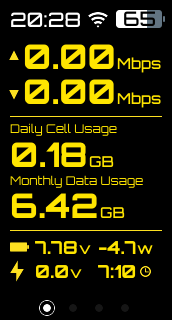
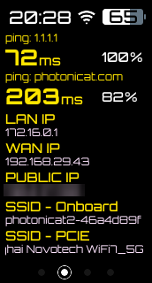
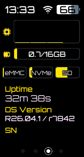
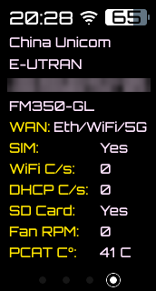

# Photonicat2 Mini Display

A Go-based display driver for the Photonicat2 mini display, providing real-time system information, network status, and device metrics on a small LCD screen.

This system ships preinstalled as a stock package on the
[Photonicat 2](https://photonicat.com) mobile router, and runs on both
OpenWrt and Debian.

## Sample Screens

Captured live over `GET /api/v1/go_frame.png` from a photonicat2 running
photonicatWrt 26.04.1, at the panel's native 172×320.

| 1 — Traffic | 2 — Connectivity | 3 — System | 4 — Modem |
|:---:|:---:|:---:|:---:|
|  |  |  |  |

Page 3 splits storage across eMMC / NVMe / SD and shows only the disks that are
actually present, so the row is one, two, or three bars wide. The public IP and
phone number are blurred out of the samples.

## 🚀 Quick Start

### Build and Test
```bash
# Build host + OpenWrt/Debian binaries and cross-compiled test runners
./compile.sh

# Run the unit tests (on Linux; compile.sh also emits test_runner_openwrt /
# test_runner_debian binaries you can scp to a device and run there)
go test .
```

### Run Application
```bash
# After building with compile.sh cross compile on X86
./pcat2_mini_display_openwrt #on openwrt
```


## Dynamic Refresh (Hz)

Both the renderer and the data collectors scale their rates to what is
actually on screen: the display is lively while you look at it and nearly
free when you don't.

### Frame Rate
| State | Frame Rate | Notes |
|-------|-----------|-------|
| **Awake** | 3 FPS | `DEFAULT_FPS`, enough for numbers and the clock |
| **Text ticker scrolling** | 30 FPS | `SCROLL_FPS`, only while a long value scrolls; reverts the moment it stops |
| **Page change** | 15 intermediate frames | Pre-rendered slide with easing; frame sleep is interrupted instantly |
| **Idle (dimmed)** | ~0.1 FPS | 1 FPS with a 10× idle sleep multiplier |
| **Backlight off** | 0 | Middle/footer rendering skipped entirely |

### Per-Page Data Collection
Every collector idles at once per minute. It speeds up only while the screen
is awake **and** the page that displays its data is visible; page changes and
idle/wake transitions reschedule the collectors immediately.

| Data Source | Idle | When its page is visible |
|-------------|------|--------------------------|
| **Battery / WAN speed / pcat-manager-web** (page 0) | 60 s | 2 Hz (500 ms) |
| **CPU / RAM / disk bars** (system page) | 60 s | 2 Hz (500 ms) |
| **Ping** (connectivity page) | 60 s | 1 Hz |
| **SMS** | 60 s | 60 s |

### Redraw Cadence
| Component | Cadence |
|-----------|---------|
| **Top bar** | Double-buffered, redrawn only when its content changes |
| **Middle content** | Every frame |
| **Footer** | Every 10th frame (every 3rd on SMS pages) |

### Ping Handling
| Test Type | Timeout | Special Handling |
|-----------|---------|------------------|
| **Ping Site 0** | 5 seconds | Red "X" for >3s timeout |
| **Ping Site 1** | 5 seconds | Keep last successful value |
| **Success Rate** | - | Tracked per ping site |

### Screen Management

#### Power & Brightness
| Setting | Default Value | On Battery | On DC Power |
|---------|---------------|------------|-------------|
| **Screen Dimmer Timeout** | 60 seconds | 60 seconds | 86400 seconds (24h) |
| **Idle Fade Duration** | 2 seconds | - | - |
| **Fade In Duration** | 300ms | - | - |
| **Zero Backlight Delay** | 5 seconds | - | - |
| **Power Off Timeout** | 3 seconds | - | - |

#### Display Optimization
| Feature | Frequency | Purpose |
|---------|-----------|---------|
| **Top Bar Cache** | Only when content changes | Avoid unnecessary redraws |
| **Footer Cache** | Only when content changes | Performance optimization |
| **FPS Display Update** | Every 100ms | Debug information |
| **Log Output** | Every 300 frames (~60s) | Reduce log spam |

### HTTP Server Timeouts
| Client Type | Timeout | Purpose |
|-------------|---------|---------|
| **External HTTPS** | 10 seconds | Public API calls |
| **TLS Handshake** | 5 seconds | Secure connections |
| **Local HTTP** | 15 seconds | Internal API calls |

### Performance Metrics
| Metric | Target/Actual | Notes |
|--------|---------------|-------|
| **Target FPS** | 3 FPS awake, 0.1–30 FPS dynamic | See Dynamic Refresh above |
| **Page Change FPS** | Variable | Depends on animation complexity |
| **Frame Sleep** | ~333ms | Maintains stable FPS |
| **Background Sleep** | 50ms | When main loop disabled |

## Configuration Files

### Main Config: `config.json`
Embedded in the binary as the package default; the user config is always
merged on top of it.
- **Ping targets**: `ping_site0`, `ping_site1`
- **Display templates**: Page layouts and elements
- **Screen settings**: Brightness, timeout values
- **SMS settings**: Enable/disable SMS display

### User Config: `/etc/pcat2_mini_display-user_config.json`
- User-specific overrides

### System Config: `/etc/pcat2_mini_display-config.json`
- System-wide defaults

## Display Elements

### Top Bar (32px height)
- **Time**: Real-time clock (HH:MM format)
- **Network**: 4G/5G/WiFi/Ethernet indicators
- **Signal Strength**: 4-bar signal indicator
- **Battery**: SOC percentage with charging indicator

### Middle Section (Variable height)
Multiple pages with rotating content:
- **Page 0**: WAN speeds, data usage, battery details
- **Page 1**: Ping results with success rates, IP addresses, SSIDs
- **Page 2**: CPU graph, RAM bar, eMMC/NVMe/SD disk bars, uptime, OS version, serial number
- **Page 3**: Carrier/ISP, modem model, SIM/SD state, WiFi & DHCP client counts, fan RPM, temps
- **SMS Pages**: When SMS display enabled

### Footer (22px height)
- **Page indicators**: Dots showing current page
- **SMS indicator**: Shows SMS page count when active

## Ping System Details

### Ping Logic
- **Timeout detection**: >3 seconds shows red "X"
- **Value persistence**: Keeps last successful ping on failure
- **Success tracking**: Calculates percentage success rate
- **Error codes**:
  - `-2`: Timeout (>3 seconds) → Red "X" display
  - `-1`: Error with no previous success → "-" display
  - `>0`: Successful ping time in milliseconds

### Debug Output
Comprehensive stdout logging shows:
- Raw ping execution details
- Timeout and error detection
- Success rate calculations
- Final display values

## Hardware Integration

### Display Driver: GC9307
- **Resolution**: 172x320 pixels
- **Rotation**: 180 degrees
- **Offset**: 34 pixels X offset
- **Margins**: L:8, R:7, T:10, B:7 pixels

### GPIO Pins
- **RST**: GPIO122
- **DC**: GPIO121  
- **CS**: GPIO13
- **Backlight**: PWM controlled

## HTTP API Endpoints

The built-in HTTP server listens on localhost port 8081 by default
(`-port` flag).

### Overview
| Endpoint | Method | Purpose |
|----------|--------|---------|
| `/api/v1/go_frame.png` | GET | PNG snapshot of the current LCD frame |
| `/api/v1/go_data.json` | GET/POST | Dump or inject display data |
| `/api/v1/go_changePage` | GET | Advance to the next page |
| `/api/v1/go_display_text.json` | GET | Draw arbitrary text on the display |
| `/api/v1/go_get_status.json` | GET | Service status |
| `/api/v1/go_get_config.json`, `go_get_user_config.json`, `go_set_user_config.json`, `go_reset_config` | GET/POST | Read, write and reset configuration |
| `/api/v1/go_set_ping_sites`, `go_set_screen_dimmer_time`, `go_set_show_sms` | POST | Runtime settings |
| `/api/v1/go_poweroff?confirm=yes` | POST | Shut the device down via the PMU |

### Backlight Control

#### Get Maximum Backlight
```http
GET /api/v1/go_get_max_backlight
```

**Response:**
```json
{
  "status": "ok",
  "max_brightness": 100
}
```

#### Set Maximum Backlight
```http
POST /api/v1/go_set_max_backlight
Content-Type: application/x-www-form-urlencoded

max_brightness=75
```

**Parameters:**
- `max_brightness` (required): Integer between 0-100

**Success Response:**
```json
{
  "status": "ok",
  "max_brightness": 75
}
```

**Error Response:**
```json
{
  "status": "error",
  "message": "max_brightness must be between 0 and 100"
}
```

**Example Usage:**
```bash
# Get current max backlight
curl http://localhost:8081/api/v1/go_get_max_backlight

# Set max backlight to 80%
curl -X POST -d "max_brightness=80" http://localhost:8081/api/v1/go_set_max_backlight

# Set max backlight to minimum (1%)
curl -X POST -d "max_brightness=1" http://localhost:8081/api/v1/go_set_max_backlight
```

## Software Architecture

### Key Features
- **HTTP Server Integration**: Control display via HTTP GET/POST requests
- **Real-Time Display Updates**: Efficient frame rendering with dynamic FPS monitoring
- **Hardware Interfacing**: periph.io libraries for SPI and GPIO control
- **Customizable Configuration**: JSON-based display element configuration

### Dependencies
- [periph.io](https://periph.io/) for hardware interfacing (SPI, GPIO)
- [golang.org/x/image](https://pkg.go.dev/golang.org/x/image) for image and font rendering
- [github.com/go-ping/ping](https://github.com/go-ping/ping) for ICMP ping functionality

## Documentation

📖 **Configuration Guides**
- [English Screen Configuration Guide](docs/screen_guide_en.md) - Comprehensive guide for customizing display content
- [中文屏幕配置指南](docs/screen_guide-zh_cn.md) - 屏幕显示内容自定义完整指南

## File Structure
```
├── main.go              # Main application loop
├── draw.go              # Display rendering functions
├── processData.go       # Data collection and processing
├── processSms.go        # SMS handling
├── httpServer.go        # HTTP API server
├── welcomeAnim.go       # Boot/wake-up animation
├── powerGraph.go        # Battery power history graph
├── linuxFallback.go     # Direct sysfs/netlink fallbacks when pcat-web is absent
├── customMetrics.go     # User-defined metrics (stocks, weather, ...)
├── pcatPmu.go           # PMU serial protocol (battery, poweroff)
├── utils.go             # Utility functions
├── config.json          # Main configuration
└── assets/              # Fonts and SVG icons
    ├── fonts/           # TTF font files
    └── svg/             # Icon files
```

## Getting Started

### Prerequisites
- Go 1.25 or higher
- Proper hardware setup for the Photonicat 2 mobile router and LCD display

```bash
apt install gcc-aarch64-linux-gnu musl-tools
wget https://musl.cc/aarch64-linux-musl-cross.tgz
sudo tar -C /usr/local -xzf aarch64-linux-musl-cross.tgz
```

### Build & Run
```bash
git clone https://github.com/photonicat/photonicat2_mini_display.git
cd photonicat2_mini_display
go mod tidy
go run .
```

### Service Installation
On photonicatWrt/OpenWrt the display ships preinstalled and is managed by
its init script:
```bash
/etc/init.d/pcat2-display-mini restart
```

On Debian, install it as a systemd service:
```bash
sudo ./install_service.sh
sudo systemctl enable pcat2_mini_display
sudo systemctl start pcat2_mini_display
```

## License
This project is licensed under the GNU General Public License v3 (GPL-3.0-only).

## Acknowledgements
- [periph.io](https://periph.io/) for hardware interfacing libraries
- The Go community for providing robust tooling and libraries
